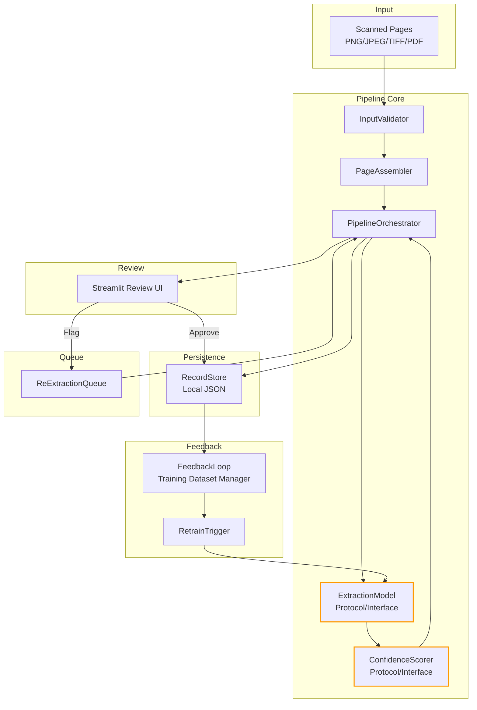

# Design Document: BMR Digitization & Validation Pipeline

## Overview

This design describes a Python-based pipeline for digitizing handwritten Batch Manufacturing Records (BMRs). The system ingests scanned pages (images/PDFs), assembles multi-page records, extracts structured data via an interchangeable LLM, scores extraction confidence, and presents results in a Streamlit review UI. Approved records are persisted as local JSON and feed an active feedback loop for model retraining.

The project lives in `bmr-digitization-pipeline/` at the monorepo root. Synthetic test data is generated into `./data/`.

### Key Design Decisions

1. **Provider-agnostic LLM interface**: An abstract `ExtractionModel` protocol allows swapping LLM providers (OpenAI, Anthropic, local models) without pipeline changes.
2. **Schema learning via prompting**: The extraction model infers BMR schema from input images rather than using hardcoded field definitions. The inferred schema is represented as a dynamic Pydantic model.
3. **LLM-as-Judge scoring**: Confidence scoring uses the same abstract interface, configurable to share the extraction model or use a separate one.
4. **Local-first persistence**: JSON files on disk, no database. Each record is a self-contained JSON file with full audit trail.
5. **Streamlit review UI**: Single-page app for viewing, editing, approving, and flagging records.
6. **Active feedback loop**: Validated records accumulate in a training dataset directory; a retraining trigger fires when new records are available.

## Architecture



### Directory Structure

```
bmr-digitization-pipeline/
├── pyproject.toml
├── README.md
├── data/                          # Synthetic/test BMR images
│   └── sample_bmr/
├── storage/                       # Runtime JSON storage
│   ├── records/                   # Persisted approved records
│   ├── queue/                     # Re-extraction queue
│   └── training/                  # Training dataset for feedback loop
├── src/
│   └── bmr_pipeline/
│       ├── __init__.py
│       ├── models.py              # Pydantic data models (Record, Field, etc.)
│       ├── input_validator.py     # File format validation
│       ├── assembler.py           # Multi-page assembly
│       ├── extraction.py          # ExtractionModel protocol + implementations
│       ├── scoring.py             # ConfidenceScorer protocol + implementations
│       ├── orchestrator.py        # Pipeline orchestration
│       ├── record_store.py        # JSON persistence
│       ├── queue.py               # Re-extraction queue
│       ├── feedback.py            # Feedback loop + retrain trigger
│       └── config.py              # Pipeline configuration
├── ui/
│   └── app.py                     # Streamlit review UI
└── tests/
    ├── __init__.py
    ├── test_models.py
    ├── test_input_validator.py
    ├── test_assembler.py
    ├── test_extraction.py
    ├── test_scoring.py
    ├── test_orchestrator.py
    ├── test_record_store.py
    ├── test_queue.py
    └── test_feedback.py
```

## Components and Interfaces

### 1. InputValidator

Validates incoming files against supported formats (PNG, JPEG, TIFF, PDF). Rejects unsupported or corrupted files with descriptive errors.

```python
class InputValidator:
    SUPPORTED_FORMATS: set[str] = {"png", "jpeg", "jpg", "tiff", "tif", "pdf"}

    def validate(self, file_path: Path) -> ValidatedInput:
        """Validate file format and readability. Raises InputValidationError on failure."""
        ...
```

### 2. PageAssembler

Stitches multiple validated pages into a single logical `Record`, preserving original page images and respecting page order.

```python
class PageAssembler:
    def assemble(self, pages: list[ValidatedInput], record_id: str | None = None) -> Record:
        """Assemble pages into a single Record. Raises AssemblyError if pages is empty."""
        ...
```

### 3. ExtractionModel (Protocol)

Provider-agnostic interface for LLM-based extraction. Implementations wrap specific providers.

```python
class ExtractionModel(Protocol):
    def extract(self, record: Record, context: str | None = None) -> ExtractionResult:
        """Extract structured fields from a Record's page images.
        
        Args:
            record: The assembled record with page images.
            context: Optional reviewer notes for re-extraction guidance.
        
        Returns:
            ExtractionResult with extracted fields and inferred schema.
        """
        ...
```

### 4. ConfidenceScorer (Protocol)

Scores each extracted field on a 0.0–1.0 scale. Configurable to use the same or a different model than extraction.

```python
class ConfidenceScorer(Protocol):
    def score(self, record: Record, extraction_result: ExtractionResult) -> list[FieldScore]:
        """Score each extracted field for confidence. Returns 0.0 for fields that fail scoring."""
        ...
```

### 5. PipelineOrchestrator

Coordinates the full pipeline flow: validate → assemble → extract → score → store. Handles re-extraction from the queue.

```python
class PipelineOrchestrator:
    def __init__(
        self,
        validator: InputValidator,
        assembler: PageAssembler,
        extractor: ExtractionModel,
        scorer: ConfidenceScorer,
        store: RecordStore,
        queue: ReExtractionQueue,
        feedback: FeedbackLoop,
    ): ...

    def process(self, file_paths: list[Path]) -> Record: ...
    def process_reextraction(self, record_id: str) -> Record: ...
```

### 6. RecordStore

Persists approved records as JSON files. Handles read/write with retry on failure.

```python
class RecordStore:
    def __init__(self, storage_dir: Path): ...
    def save(self, record: Record) -> Path: ...
    def load(self, record_id: str) -> Record: ...
    def list_records(self) -> list[RecordSummary]: ...
```

### 7. ReExtractionQueue

Manages flagged records awaiting re-extraction, with reviewer notes attached.

```python
class ReExtractionQueue:
    def __init__(self, queue_dir: Path): ...
    def enqueue(self, record_id: str, reviewer_notes: str) -> None: ...
    def dequeue(self) -> tuple[str, str] | None: ...
    def pending(self) -> list[str]: ...
```

### 8. FeedbackLoop

Manages the training dataset and triggers retraining when new validated records are available.

```python
class FeedbackLoop:
    def __init__(self, training_dir: Path): ...
    def add_validated_record(self, record: Record) -> None: ...
    def should_retrain(self) -> bool: ...
    def trigger_retrain(self) -> RetrainEvent: ...
```

### 9. Streamlit Review UI

Single-page Streamlit app (`ui/app.py`) that:
- Lists records ordered by extraction date (most recent first)
- Displays extracted fields with confidence scores (color-coded)
- Shows original scanned page images alongside extracted data
- Supports inline editing of field values
- Approve individual fields or entire records
- Flag records for re-extraction with required reviewer notes

## Data Models

```python
from pydantic import BaseModel, Field
from datetime import datetime
from enum import Enum
import uuid

class FieldStatus(str, Enum):
    PENDING = "pending"
    APPROVED = "approved"
    EDITED = "edited"

class RecordStatus(str, Enum):
    PENDING_REVIEW = "pending_review"
    APPROVED = "approved"
    FLAGGED = "flagged"
    FAILED = "failed"

class ExtractedField(BaseModel):
    name: str
    value: str | None
    confidence: float = Field(ge=0.0, le=1.0, default=0.0)
    status: FieldStatus = FieldStatus.PENDING
    original_value: str | None = None  # Preserved when edited

class ExtractionAttempt(BaseModel):
    attempt_number: int
    timestamp: datetime
    fields: list[ExtractedField]
    reviewer_notes: str | None = None  # Notes that guided this attempt
    model_id: str  # Which model performed extraction

class ReviewerAction(BaseModel):
    action: str  # "approve_field", "approve_record", "edit_field", "flag_record"
    timestamp: datetime
    field_name: str | None = None
    old_value: str | None = None
    new_value: str | None = None
    notes: str | None = None

class PageImage(BaseModel):
    page_number: int
    file_path: str
    original_filename: str

class Record(BaseModel):
    id: str = Field(default_factory=lambda: str(uuid.uuid4()))
    status: RecordStatus = RecordStatus.PENDING_REVIEW
    pages: list[PageImage] = []
    current_fields: list[ExtractedField] = []
    extraction_history: list[ExtractionAttempt] = []
    reviewer_actions: list[ReviewerAction] = []
    created_at: datetime = Field(default_factory=datetime.utcnow)
    updated_at: datetime = Field(default_factory=datetime.utcnow)
    inferred_schema: dict | None = None  # Schema learned from extraction

class ExtractionResult(BaseModel):
    fields: list[ExtractedField]
    inferred_schema: dict
    model_id: str
    error: str | None = None

class FieldScore(BaseModel):
    field_name: str
    confidence: float = Field(ge=0.0, le=1.0)

class RetrainEvent(BaseModel):
    timestamp: datetime
    records_added: int
    total_training_records: int

class RecordSummary(BaseModel):
    id: str
    status: RecordStatus
    field_count: int
    avg_confidence: float
    created_at: datetime

class ValidatedInput(BaseModel):
    file_path: str
    format: str
    file_size: int
```


## Correctness Properties

*A property is a characteristic or behavior that should hold true across all valid executions of a system — essentially, a formal statement about what the system should do. Properties serve as the bridge between human-readable specifications and machine-verifiable correctness guarantees.*

### Property 1: Supported format acceptance

*For any* file with a supported extension (PNG, JPEG, JPG, TIFF, TIF, PDF) and valid content, the InputValidator SHALL accept the file as valid input without error.

**Validates: Requirements 1.1, 1.2**

### Property 2: Unsupported format rejection

*For any* file with an extension not in the supported set (PNG, JPEG, JPG, TIFF, TIF, PDF), the InputValidator SHALL reject the file and return an error message that contains the unsupported format name.

**Validates: Requirements 1.3**

### Property 3: Assembly preserves page order and content

*For any* non-empty list of validated pages, the PageAssembler SHALL produce a Record containing exactly the same pages in the same order, with all original page image references preserved.

**Validates: Requirements 2.1, 2.2, 2.3**

### Property 4: Confidence scores are in valid range

*For any* set of extracted fields submitted to the ConfidenceScorer, every returned field score SHALL be a float in the range [0.0, 1.0] inclusive, and every extracted field SHALL have a corresponding score.

**Validates: Requirements 4.1, 4.3**

### Property 5: Record approval marks all fields approved

*For any* Record with one or more extracted fields, approving the entire Record SHALL result in every field having status APPROVED.

**Validates: Requirements 5.3, 5.4**

### Property 6: Records are listed in descending date order

*For any* set of Records with distinct creation timestamps, listing Records SHALL return them ordered by creation date descending (most recent first).

**Validates: Requirements 5.7**

### Property 7: Queue enqueue/dequeue preserves record ID and notes

*For any* record ID and reviewer notes string, enqueuing then dequeuing from the ReExtractionQueue SHALL return the same record ID and the same reviewer notes.

**Validates: Requirements 6.1**

### Property 8: Re-extraction updates current fields and preserves full history

*For any* Record that has undergone N extraction attempts, after a re-extraction the Record SHALL have N+1 entries in its extraction history, the current fields SHALL reflect the latest extraction, and all previous attempts SHALL be preserved unchanged.

**Validates: Requirements 6.3, 6.4**

### Property 9: Record IDs are unique

*For any* set of Records created by the pipeline, all Record IDs SHALL be distinct.

**Validates: Requirements 7.3**

### Property 10: Record serialization round-trip

*For any* valid Record object (including fields, extraction history, reviewer actions, and confidence scores), serializing to JSON and then deserializing back SHALL produce an equivalent Record object.

**Validates: Requirements 9.1, 9.2, 9.3**

## Error Handling

| Scenario | Component | Behavior |
|---|---|---|
| Unsupported file format | InputValidator | Raise `InputValidationError` with format name in message |
| Corrupted/unreadable file | InputValidator | Raise `InputValidationError` indicating file could not be read |
| Empty page list for assembly | PageAssembler | Raise `AssemblyError` indicating at least one page required |
| Extraction returns no fields | PipelineOrchestrator | Set Record status to `FAILED`, store error details in Record |
| Confidence scoring fails for a field | ConfidenceScorer | Assign 0.0 to that field, flag scoring failure in Record metadata |
| JSON write failure | RecordStore | Raise `PersistenceError`, retain Record in memory for retry |
| Invalid JSON on deserialization | RecordStore | Raise `SchemaValidationError` with descriptive message identifying the violation |
| Flagging without reviewer notes | Review UI | Reject the flag action, prompt for required notes |

All errors use a custom exception hierarchy:

```python
class PipelineError(Exception): ...
class InputValidationError(PipelineError): ...
class AssemblyError(PipelineError): ...
class ExtractionError(PipelineError): ...
class ScoringError(PipelineError): ...
class PersistenceError(PipelineError): ...
class SchemaValidationError(PipelineError): ...
```

## Testing Strategy

### Property-Based Tests (Hypothesis)

The project uses [Hypothesis](https://hypothesis.readthedocs.io/) for property-based testing. Each property test runs a minimum of 100 iterations.

| Property | Test File | What It Validates |
|---|---|---|
| Property 1: Supported format acceptance | `test_input_validator.py` | Req 1.1, 1.2 |
| Property 2: Unsupported format rejection | `test_input_validator.py` | Req 1.3 |
| Property 3: Assembly preserves pages | `test_assembler.py` | Req 2.1, 2.2, 2.3 |
| Property 4: Confidence scores in range | `test_scoring.py` | Req 4.1, 4.3 |
| Property 5: Record approval marks all fields | `test_models.py` | Req 5.3, 5.4 |
| Property 6: Records listed by date desc | `test_record_store.py` | Req 5.7 |
| Property 7: Queue round-trip | `test_queue.py` | Req 6.1 |
| Property 8: Re-extraction preserves history | `test_orchestrator.py` | Req 6.3, 6.4 |
| Property 9: Unique record IDs | `test_models.py` | Req 7.3 |
| Property 10: Serialization round-trip | `test_models.py` | Req 9.1, 9.2, 9.3 |

Each test is tagged with: `# Feature: bmr-digitization-pipeline, Property N: <title>`

### Unit Tests (pytest)

Example-based tests for specific scenarios and edge cases:

- Corrupted file rejection (Req 1.4)
- Empty page list assembly error (Req 2.4)
- Schema inference varies by BMR format (Req 3.2)
- Provider-agnostic interface with multiple implementations (Req 3.4)
- Failed extraction marks record as FAILED (Req 3.5)
- Scorer configuration (same vs separate model) (Req 4.2)
- Scoring failure defaults to 0.0 (Req 4.4)
- Flagging requires reviewer notes (Req 5.5)
- Write failure retains record for retry (Req 7.4)
- Invalid JSON deserialization error messages (Req 9.4)
- Retraining trigger logging (Req 8.4)

### Integration Tests

- End-to-end pipeline: ingest → assemble → extract → score → review → persist (with mock LLM)
- Re-extraction flow: flag → queue → re-extract → verify history
- Feedback loop: persist → training dataset → retrain trigger
- Streamlit UI smoke test: app loads, renders sample record

### Test Data

Synthetic BMR images are generated into `./data/` for testing. Test fixtures use Hypothesis strategies to generate random `Record`, `ExtractedField`, and `ExtractionAttempt` objects.
