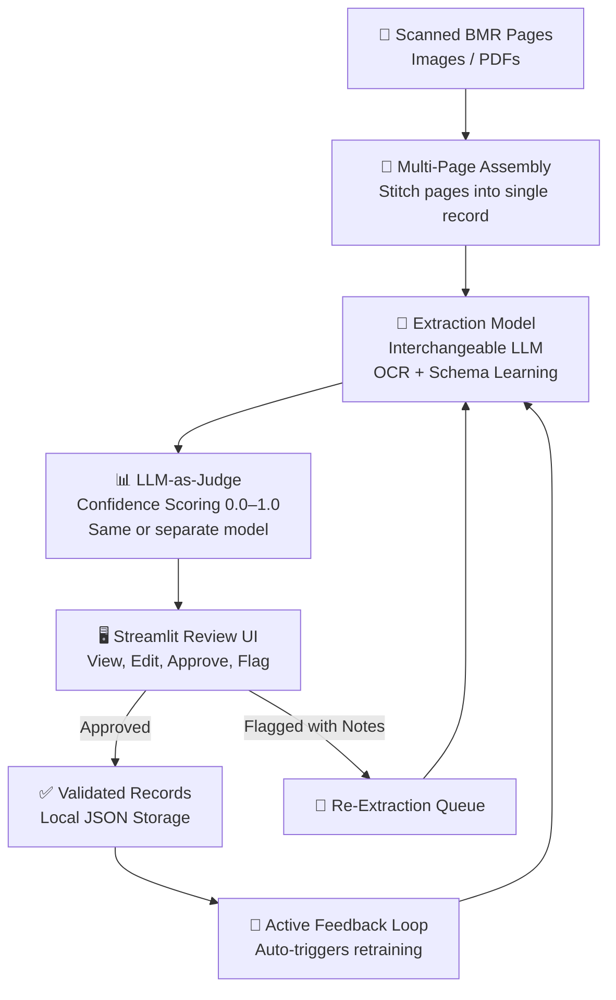

# BMR Digitization & Validation Pipeline

## Overview

A pipeline for digitizing handwritten Batch Manufacturing Records (BMRs) using AI-powered extraction, automated quality scoring, and human-in-the-loop validation. The end state is a repository of human-validated BMR data with a Streamlit-based review UI, feeding an active loop for continuous model improvement.

## Pipeline

## Stages

### 1. Input Capture & Assembly

- Handwritten BMRs are scanned or photographed as images or PDFs.
- A single BMR may span multiple pages — pages are assembled into one logical record before extraction.

### 2. Extraction & Schema Learning

- An interchangeable LLM (vision/multimodal) parses handwritten content from assembled inputs.
- The model learns and infers the BMR schema from the data — no hardcoded field definitions.
- Extracted values are output as structured data (JSON / Pydantic).
- The extraction model is swappable — the pipeline is not coupled to a specific LLM provider.

### 3. Confidence Scoring (LLM-as-Judge)

- Each extracted field is scored on a continuous scale (0.0–1.0) for extraction confidence.
- The judge can be the same model used for extraction or a separate model — configurable per deployment.

### 4. Human Review (Streamlit UI)

- Extraction results and confidence scores are presented in a Streamlit web app.
- Reviewers can:
  - View each extracted field alongside its confidence score.
  - Edit or correct extracted values inline.
  - Approve individual fields or entire records.
  - Flag records for re-extraction with reviewer notes explaining the issue.

### 5. Re-Extraction

- Flagged records (with reviewer notes) are sent back to the extraction model for another pass.
- Reviewer notes are provided as context to guide improved extraction.

### 6. Persistence

- Approved, human-validated records are saved locally as JSON files.
- Each record retains its extraction history, confidence scores, and reviewer actions for auditability.

### 7. Active Feedback Loop

- Validated records automatically feed back into the training/fine-tuning pipeline.
- As validated data accumulates, the extraction and scoring models are retrained to improve over time.

## Out of Scope (for now)

- User authentication / multi-user support
- Volume / scalability considerations
- Cloud storage or database backends (starting local-first)
